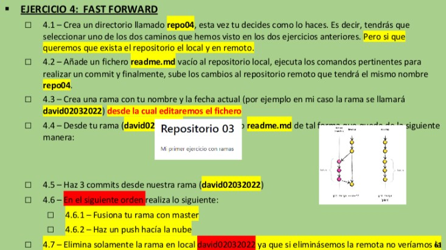

4.1 ➡ Creamos el repositorio en el escritorio.

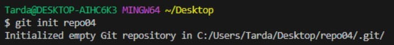

4.2 ➡ Añadimos el readme a la Staging Area y hacemos un commit.

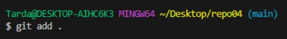  
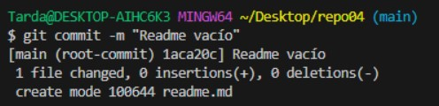

Conectamos repositorios y hacemos un push.

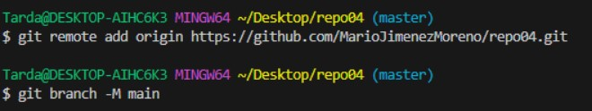
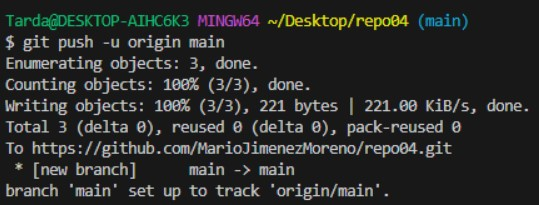

4.3 ➡ Creamos una rama con mi nombre y la fecha actual.

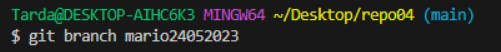

4.5 ➡ Hacemos 3 commits a la rama "mario24052023"

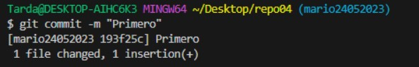
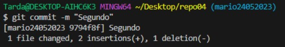
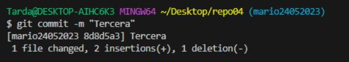

4.6 ➡ Nos movemos a la rama "main" y hacemos merge de los 3 commits de la rama "mario24052023".

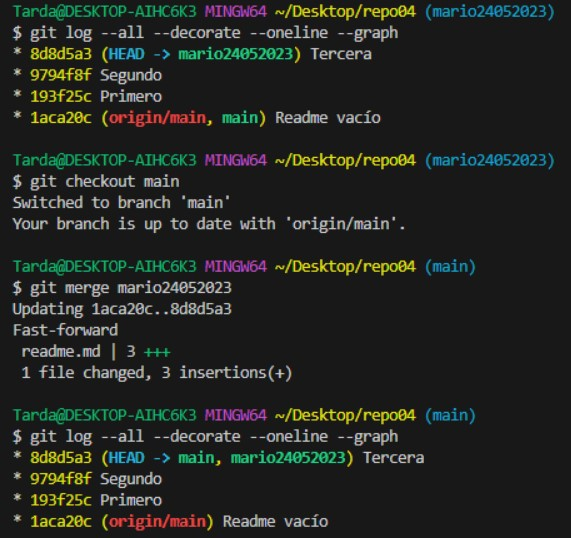

4.7 ➡ Eliminamos la rama "mario24052023" del repositorio local.

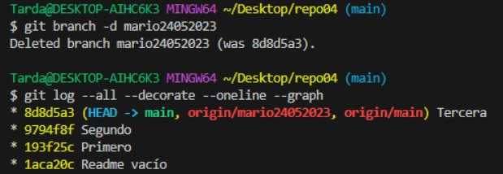

